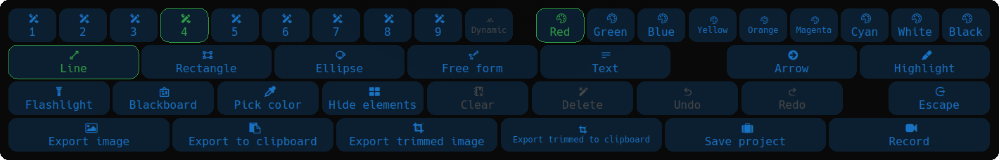

<div align="center">
  
  <h1>ZoomMe</h1>
</div>

Application for zooming/**magnifying** and **annotating** the desktop (like ZoomIt under windows).

You can...
- Draw lines, rectangles, arrows, ellipses and hand draws (free forms)!
- Insert text
- Highlight parts of the screen with colors (a highlighter)
- Use a "Flashlight" function to concentrate attention on the cursor position
- Zoom in and out of the desktop.
- Switch between your desktop and a blackboard
- Save the current work to an image
- Record what you do
- Save the current work in a `.zoomme` file and [recover from it later](#restore-from-file) (like a project/backup file)

Made with Qt6 (it works with Qt5 too. There's an [older branch for that](https://github.com/Ezee1015/zoomme/tree/Qt5)) and OpenGL.

### Tool bar (available tools)


### Demonstration


> *The idea of the Flashlight effect was taken from [tsoding/boomer](https://github.com/tsoding/boomer)*

## Index

* [Functions & Mappings](#functions--mappings)
    * [Essential](#essential)
    * [Non-essential](#non-essential)
* [Dependencies](#dependencies)
* [Instalation (Compilation)](#instalation-compilation)
    * [Compile with cmake (recommended)](#compile-with-cmake-recommended)
    * [Compile with qmake](#compile-with-qmake)
* [Running (flags)](#running-flags)
    * [Synopsis](#synopsis)
        * [Configuration](#configuration)
        * [Modes](#modes)
* [:suspect: Secret :suspect:](#suspect-secret-suspect)
* [Credit](#credit)

## Functions & Mappings

### Essential
|          Key/Event         | Function                                                                                                                                                                                                                                    |
|:--------------------------:|---------------------------------------------------------------------------------------------------------------------------------------------------------------------------------------------------------------------------------------------|
| Press & Hold **`Control`** | This will show a panel with all the available tools, allowing you to interact with the app without the need to remember all the key mappings, except for the essentials ones.                                                               |
|      **`Mouse Wheel`**     | To zoom in and zoom out                                                                                                                                                                                                                     |
|         **`Shift`**        | When it's zoomed in, if you press and hold the key, the screen will not follow the mouse, so you can freely move it around in that part of the screen (for drawing, for example). When you release it, it will continue following the mouse |
|  **`Shift + Mouse Wheel`** | **When the flashlight effect is turn on**, this will increase/decrease the size of the "light"                                                                                                                                              |
|  **`Right Mouse Button`**  | When the mouse tracking is disabled, you can drag the canvas around                                                                                                                                                                         |
|          **`ESC`**         | The function of the Escape key is described [in here](#escape-key-functions)...                                                                                                                                                             |

#### Escape key functions

The Escape key performs the following actions in a sequential order. If one condition applies, it executes only that function.

1. If you are writing text, it **finishes writing text**.
2. If you are inside a mode (pick a color, delete a drawing, trim or the flashlight effect), it **exits that mode**
3. If you are in **'hide all' mode**, it restores to 'show all'
4. If you are zoomed in, it **restores the zoom**
5. If you are recording, it **stops recording**
6. Otherwise, it **quits/exits the app**


#### Text Mode Mappings

|          Key          | Function                                                                                                                                                  |
|:---------------------:|-----------------------------------------------------------------------------------------------------------------------------------------------------------|
|      **`Enter`**      | To finish writing text                                                                                                                                    |
|   **`Shift+Enter`**   | To make a new line when writing text                                                                                                                      |
| **`Left/Right keys`** | To go to the previous/next character when writing text                                                                                                    |
|   **`Up/Down keys`**  | To go to the previous/next line break when writing text                                                                                                   |
|   **`Click a text`**  | You can access and modify the text by clicking on it when you're in text mode. However, you cannot be writing or drawing a new text while clicking |

---

### Non-essential

#### Export

|    Key/Event    | Function                                                                                                                                                                                                                                                                                                                                                                                                          |
|:---------------:|-------------------------------------------------------------------------------------------------------------------------------------------------------------------------------------------------------------------------------------------------------------------------------------------------------------------------------------------------------------------------------------------------------------------|
|     **`S`**     | Save the current work to an image, which will be stored in the Desktop folder (or the current path if not found). The computer will *beep* if the image was correctly saved                                                                                                                                                                                                                                       |
| **`Shift + S`** | Save the current work to the clipboard. The computer will *beep* once the mapping is pressed                                                                                                                                                                                                                                                                                                                      |
| **`Shift + E`** | Save the current work inside a '.zoomme' file, so you can [later restore the state of the program](#restore-from-file) from it. It is going to be save in the same path and with the same name that the image of the screenshot. The computer will *beep* if the file was correctly saved                                                                                                                         |
|  **`-`** (dash) | Start/stop recording. After stopping, a video will be produced, but it may take some time for rendering (You'll know when it finished rendering when the recording indicator of the status bar goes away and you listen a *beep*). The video is going to be save in the same path and with the same name that the image of the screenshot. **Requirements**: have `ffmpeg` installed, and use a Unix based system |

#### General
|     Key/Event    | Function                                                                                                      |
|:----------------:|---------------------------------------------------------------------------------------------------------------|
| **`.`** (period) | To toggle the "Flashlight effect" on the cursor.                                                              |
|     **`Tab`**    | To toggle between your screen and a blackboard mode. By the way, your drawings will persist between the modes |
|    **`Space`**   | To toggle the visibility of the elements of the screen: hide the status bar, hide all or show all             |


#### Available Drawing Modes

|   Key   | Function                                              |
|:-------:|-------------------------------------------------------|
| **`Z`** | To change the mode to drawing Lines (mode by default) |
| **`X`** | To change the mode to drawing Rectangles              |
| **`E`** | To change the mode to drawing Ellipses                |
| **`F`** | To change the mode to drawing Free forms / Hand draws |
| **`T`** | To change the mode to insert Text                     |
| **`H`** | To highlight the background of the forms/drawings     |
| **`A`** | To draw an arrow at the end of the line               |

#### Available Actions for the drawing modes

|       Key       | Function                                                                                                                               |
|:---------------:|----------------------------------------------------------------------------------------------------------------------------------------|
|     **`U`**     | To delete the last drawing of the current draw mode (undo)                                                                             |
| **`Shift + R`** | To redo the last deleted drawing of the current draw mode (redo)                                                                       |
|     **`,`**     | To delete a drawing (from the current mode) with the mouse. You can exit by deleting a form, with the Escape key or pressing `,` again |
|     **`Q`**     | To clear all the drawings                                                                                                              |

#### Change the color of the lines

|   Key   | Function                        |
|:-------:|---------------------------------|
| **`R`** | To change color to Red          |
| **`G`** | To change color to Green        |
| **`B`** | To change color to Blue         |
| **`C`** | To change color to Cyan         |
| **`M`** | To change color to Magenta      |
| **`Y`** | To change color to Yellow       |
| **`O`** | To change color to Orange       |
| **`W`** | To change color to White        |
| **`D`** | To change color to Black        |
| **`P`** | To pick a color from the screen |

#### Change the size of the lines
|   Key   | Function                        |
|:-------:|---------------------------------|
| **`1`** | To change the width to 1 pixel  |
| **`2`** | To change the width to 2 pixels |
| **`3`** | To change the width to 3 pixels |
| **`4`** | To change the width to 4 pixels |
| **`5`** | To change the width to 5 pixels |
| **`6`** | To change the width to 6 pixels |
| **`7`** | To change the width to 7 pixels |
| **`8`** | To change the width to 8 pixels |
| **`9`** | To change the width to 9 pixels |

## Dependencies
- `build-essential`
- `qt6`
- `libopengl-dev`
- A [nerd font](https://github.com/ryanoasis/nerd-fonts/releases/latest). I use [Hack nerd font](https://github.com/ryanoasis/nerd-fonts/releases/latest/download/Hack.tar.xz)

### Optional
- `xclip` (for Linux and X11)
- `wl-clipboard` (for Linux and Wayland)

## Instalation (Compilation)


Choose one build system:

### Compile with cmake (recommended)
Install dependencies:
- Debian-based: `sudo apt install build-essential qt6-base-dev libqt6opengl6-dev libqt5opengl5-dev cmake`
- Arch-based: `sudo pacman -S base-devel qt6-base cmake`

Install a compatible font (nerd font): [download font](https://github.com/ryanoasis/nerd-fonts/releases/latest).

> Personally, I use [Hack nerd font](https://github.com/ryanoasis/nerd-fonts/releases/latest/download/Hack.tar.xz)

Compile:
```bash
cmake .
make
```
You're ready. Now you can [run it](#running-flags).

> [!TIP]
> **FOR DEVELOPERS**
>
> Fix the LSP problem with the Qt libraries not being found (in my case Neovim with Clangd):
> ```bash
> cmake -DCMAKE_EXPORT_COMPILE_COMMANDS=ON
> ```

### Compile with qmake
Install dependencies:
- Debian-based: `sudo apt install build-essential qt6-base-dev libqt6opengl6-dev libqt5opengl5-dev`
- Arch-based: `sudo pacman -S base-devel qt6-base`

Compile:
```bash
qmake6 -makefile zoomme.pro
make
```

You're ready. Now you can [run it](#running-flags).

## Running (flags)

> [!WARNING]
> When using Wayland, this program is unable to take a screenshot, so it must be run with either the [-l flag](#live-mode)
> for a transparent background or th [-i flag](#from-image) for grabbing an image

> - [ `--help` ] Show the help message
>
> ```bash
> ./zoomme --help
> ```

### Synopsis

```bash
./zoomme {configurations} {mode}
```

#### Configuration

```bash
./zoomme {[-p path/to/folder] [-n name_of_file] [-e:i jpg] [-e:v gif]} {mode}
```

- [ `-p` ] Set the path where the produced files will be saved
    - It can be an absolute or relative path
    - By default, ZoomMe saves it to the `Desktop` folder

- [ `-n` ] Set the name of the produced files
    - By default, the name will be: `Zoomme dd-mm-yyyy hh.mm.ss`. The format of the date can be customized in the `zoomwidget.hpp` file

- [ `-e:i` ] Set the extension of the exported image (when pressing the 's' key)
    - By default, the extension will be: `png`

- [ `-e:v` ] Set the extension of the recorded video (when pressing the '-' key)
    - By default, the extension will be: `mp4`

#### Modes

<!-- Start 7 -->
<details id="live-mode">
<summary><b>[ <code>-l</code> ] Use a transparent background. No zooming allowed, only drawing</b></summary><p>

```bash
./zoomme {configurations} {-l}
```

</p></details>
<!-- End 7 -->

<!-- Start 8 -->
<details id="from-image">
<summary><b>[ <code>-i</code> ] Use an image as the background (instead of the desktop)</b></summary><p>

 You can modifying any image (including previously saved images from ZoomMe)

```bash
./zoomme {configurations} {-i path/to/image [-w|h] [--replace-on-save]}
```

##### Additional arguments:
- You can force the image to fit the screen's width or height with `-w` or `-h` after providing the image path, like this: `./zoomme -i path/to/image -w`, if you do not providing anything, it automatically detects the best option.

- You can overwrite the image provided when saving by doing this: `./zoomme -i path/to/image --replace-on-save`. This will autocomplete the `-p`, `-n` and `-e:i` arguments for you. How kind :)

</p></details>
<!-- End 8 -->

<!-- Start 9 -->
<details id="restore-from-file">
<summary><b>[ <code>-r</code> ] Restore the state of the program from a `.zoomme` file</b></summary><p>

Load/Restore the state of the program saved in that file. It should be a `.zoomme` file.

Ensure that you execute the file on the same monitor where it was previously run, or ensure that both monitors have the same resolution for optimum results. Otherwise, if the resolutions (between the saved one and the actual monitor) differ, the image (including the drawings) will be scaled, and while it will still work, the image may lose quality

This will override the [file name, video extension and image extension configuration](#configuration) for exporting files with the saved one. **You can still change the [save path](#configuration), as it's not saved in the `.zoomme` file**

```bash
./zoomme {configurations} {-r path/to/file.zoomme [-w|h]}
```

##### Additional arguments:
- If the resolutions differ, you can force the image to fit the screen's width or height with `-w` or `-h` after providing the image path, like this: `./zoomme -r path/to/file.zoomme -w`, if you do not providing anything, it automatically detects the best option.

</p></details>
<!-- End 9 -->

<!-- Start 10 -->
<details id="from-clipboard">
<summary><b>[ <code>-c</code> ] Use an image from the clipboard as the background (instead of the desktop)</b></summary><p>

 You can use any image from the clipboard as the background

```bash
./zoomme {configurations} {-c [-w|h]}
```

##### Additional arguments:
- You can force the image to fit the screen's width or height with `-w` or `-h`, like this: `./zoomme -c -w`, if you do not providing anything, it automatically detects the best option.

</p></details>
<!-- End 10 -->

<!-- Start 11 -->
<details id="empty">
<summary><b>[ <code>--empty</code> ] Create an empty blackboard</b></summary><p>

 You can create an empty blackboard with the given size.

```bash
./zoomme {configurations} {--empty [width] [height]}
```

</p></details>
<!-- End 11 -->

## :suspect: Secret :suspect:
> Shhh! Don't tell anybody... :zipper_mouth_face:
>
> You can customize certain features in the app :art: by editing the header file (`zoomwidget.hpp`). Within this file, there are macros that determine various program behaviors. You can modify the content of these macros located inside the "Customization" comment section. To apply the changes you've made, simply recompile the program.
>
> The customizable elements are:
>
> - Color codes for the color of the drawings
> - The font size (increase/decrease the size factor, when the default font size is too small or too big)
> - The date format when saving screenshots, recordings and `.zoomme` files
> - Icons in the status bar
> - FPS and quality of the recording
> - Default folder for exporting files
> - And more!


## Credit
- Magnifying glass icon: Research or Magnifying Glass Flat Icon Vector.svg from Wikimedia Commons by Videoplasty.com, CC-BY-SA 4.0
- Pencil: The "Pencil" icon used by MobiText from Wikimedia Commons by Gavinstubbs09, CC-BY-SA-3.0
- Color pallet/scheme: [yeun/open-color](https://github.com/yeun/open-color)
- [Color picker mouse icon](https://github.com/ful1e5/BreezeX_Cursor/blob/main/bitmaps/BreezeX-Dark/color-picker.png)
